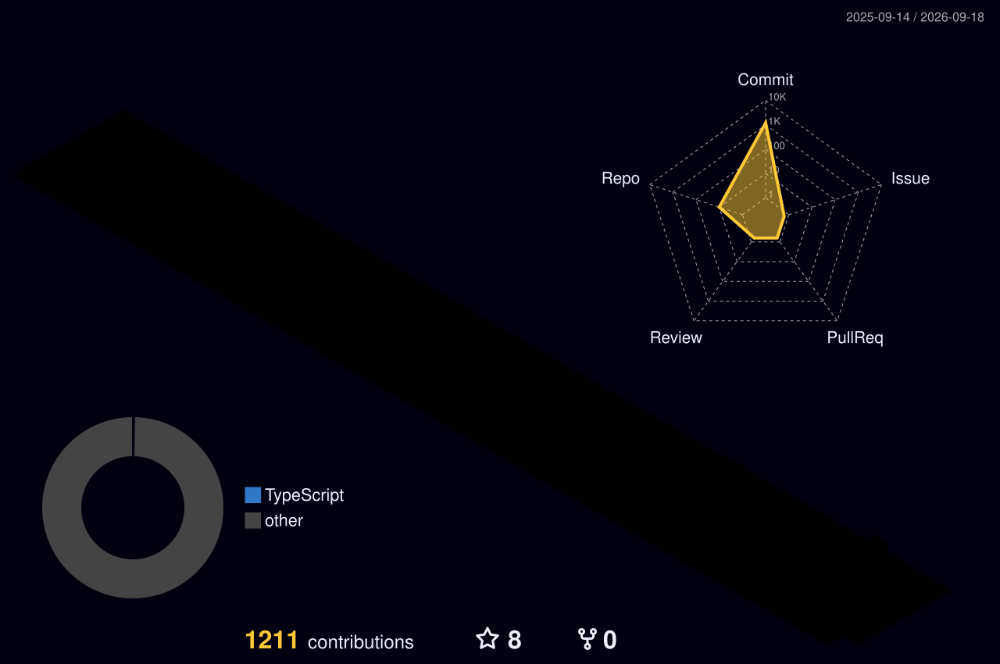

<h1 align="center">Hi, I'm Lewis </h1>

  <b>Intern Web Developer</b> @ <a href="https://github.com/FamilySearch">FamilySearch</a> · Lehi, UT 
  TypeScript · React · Node.js

  <a href="https://paxuni.com/">paxuni.com</a> ·
  <a href="https://g1creative.com/">g1creative.com</a> ·
  <a href="https://lewisportfolio.com/">portfolio</a>

  
  
  

---

### 🐍 Watch the snake eat my commits

<picture>
  <source media="(prefers-color-scheme: dark)" srcset="https://raw.githubusercontent.com/lewismillerg1/lewismillerg1/output/snake-dark.svg">
  <source media="(prefers-color-scheme: light)" srcset="https://raw.githubusercontent.com/lewismillerg1/lewismillerg1/output/snake.svg">
  
</picture>

---

### 🌆 My year in commits, in 3D

---

### 📊 Stats

### 📅 Commits, isometric

---

### 🚀 Projects

| Project | What it is |
| --- | --- |
| **[wedding](https://github.com/lewismillerg1/wedding)** | Wedding invitations site — TypeScript |
| **[leagueville](https://github.com/lewismillerg1/leagueville)** | League management web app |
| **[gym-app](https://github.com/lewismillerg1/gym-app)** | Workout tracking app |
| **[couples-game](https://github.com/lewismillerg1/couples-game)** | Party game for couples |
| **[agent-teams-ai](https://github.com/lewismillerg1/agent-teams-ai)** | Multi-agent AI experiment |
| **[discord-bot](https://github.com/lewismillerg1/discord-bot)** | Discord automation bot |
| **[FamilySearchRPG](https://github.com/lewismillerg1/FamilySearchRPG)** | Genealogy-themed RPG |
| **[svu-campus-clash](https://github.com/lewismillerg1/svu-campus-clash)** | Campus multiplayer game |

---

The snake and 3D graph regenerate themselves daily via GitHub Actions — no tokens required.

